# Reaglex — System Overview for Flutterwave API Access

**Document version:** 1.0  
**Date:** May 2026  
**Prepared for:** Flutterwave — Payment API Key / Live Account Review  
**Platform:** Reaglex (https://reaglex.com — multi-vendor marketplace)  
**Primary market:** Rwanda (RWF) · International cards supported (USD, EUR, GBP, and others)

---

## Purpose of this document

Reaglex is a multi-vendor e-commerce marketplace. We request Flutterwave **live API credentials** to:

1. **Collect buyer payments** at checkout (cards, bank transfer, mobile money via Flutterwave hosted checkout)
2. **Verify transactions** after payment (redirect callback + webhooks)
3. **Refund buyers** when orders are cancelled, returned, or disputed
4. **Pay sellers** via Flutterwave Transfer API after delivery is confirmed (escrow release)

This document describes **how our current system works**, end to end, in the order funds move through the platform. It is based on our production codebase — not a proposed redesign.

---

## 1. What Reaglex does

| Item | Description |
|------|-------------|
| **Business model** | Marketplace intermediary — Reaglex does not own inventory. Third-party sellers list products; buyers purchase through one checkout. |
| **Revenue** | Platform commission (~5% per order) + seller subscription fees (separate billing stream) |
| **Buyer protection** | Escrow — seller funds are held until buyer confirms delivery or auto-release timer expires |
| **Seller protection** | Payment is captured before fulfillment begins; disputes freeze escrow pending admin review |
| **Products sold** | Physical goods, digital downloads, services, and pickup orders across general retail categories |
| **Tech stack** | React web app + Expo mobile app · Node.js/Express API · MongoDB · Redis |

---

## 2. User roles

| Role | What they do |
|------|--------------|
| **Guest** | Browse catalog, estimate shipping, track orders by order number |
| **Buyer** | Register, add to cart, checkout, pay, track orders, confirm delivery, request returns, open disputes |
| **Seller** | Complete KYC, list products, fulfill orders, handle returns, receive payouts to bank/MoMo |
| **Admin** | Approve KYC, manage orders, resolve disputes, configure payment gateways, oversee finance |

**Checkout requires a logged-in buyer account.** Sellers must pass identity verification (government ID + selfie match) before products go live.

---

## 3. Master system flowchart

The diagram below shows the **complete lifecycle** from seller onboarding through buyer payment, fulfillment, exceptions (returns/refunds/disputes), and seller payout — including every point where Flutterwave APIs are used.

```mermaid
flowchart TB
    subgraph PHASE1["PHASE 1 — SELLER ONBOARDING"]
        direction TB
        SO1["Seller registers account"] --> SO2["Verify phone + email"]
        SO2 --> SO3["Submit government ID scan"]
        SO3 --> SO4["Submit selfie face match"]
        SO4 --> SO5["Admin reviews KYC queue"]
        SO5 --> SO6["Seller approved — can list products"]
        SO6 --> SO7["Seller registers payout method<br/>(bank account or mobile money)"]
    end

    subgraph PHASE2["PHASE 2 — BUYER DISCOVERS & SELECTS"]
        direction TB
        BD1["Buyer browses catalog<br/>(home, search, product pages)"] --> BD2["Select variant + quantity"]
        BD2 --> BD3["Add to cart<br/>(client-side cart)"]
        BD3 --> BD4["Navigate to checkout"]
    end

    subgraph PHASE3["PHASE 3 — CHECKOUT & ORDER CREATION"]
        direction TB
        CH1["Step 1: Shipping address"] --> CH2["Step 2: Delivery method<br/>(standard / express / pickup)"]
        CH2 --> CH3["Step 3: Select payment method"]
        CH3 --> CH4["Step 4: Review + Place order"]
        CH4 --> CH5["POST /api/orders<br/>Creates order per seller/warehouse group"]
        CH5 --> CH6{"Payment method?"}
    end

    subgraph PHASE4A["PHASE 4A — ONLINE PAYMENT (FLUTTERWAVE)"]
        direction TB
        FW1["POST /api/payments/initialize<br/>paymentMethod: flutterwave"] --> FW2["Flutterwave Payment.initiate()<br/>tx_ref: REAGLEX-orderId-timestamp"]
        FW2 --> FW3["Buyer redirected to<br/>Flutterwave hosted checkout"]
        FW3 --> FW4["Buyer pays<br/>(card / bank / mobile money)"]
        FW4 --> FW5{"Confirmation path"}
        FW5 -->|"Redirect"| FW6["GET /api/payments/verify<br/>Transaction.verify()"]
        FW5 -->|"Webhook"| FW7["POST /api/webhooks/flutterwave/webhook<br/>event: charge.completed<br/>verif-hash validated"]
        FW6 --> FW8["finalizeSuccessfulEscrowPayment()"]
        FW7 --> FW8
        FW8 --> FW9["Inventory decremented"]
        FW9 --> FW10["Fees calculated<br/>Platform ~5% + Flutterwave ~1.4%"]
        FW10 --> FW11["escrow.status → ESCROW_HOLD"]
        FW11 --> FW12["Seller wallet pending += seller net"]
        FW12 --> FW13["TransactionLog: PAYMENT + FEE"]
        FW13 --> FW14["Notify buyer + seller"]
    end

    subgraph PHASE4B["PHASE 4B — CASH ON DELIVERY (RWANDA)"]
        direction TB
        COD1["Order created — no online payment"] --> COD2["Inventory reserved<br/>status → processing"]
        COD2 --> COD3["Seller fulfills + collects cash on delivery"]
    end

    subgraph PHASE5["PHASE 5 — ORDER FULFILLMENT"]
        direction TB
        FF1["Seller receives NEW_ORDER_PAID notification"] --> FF2["Seller: processing → packed"]
        FF2 --> FF3["Seller ships + adds tracking<br/>escrow → SHIPPED"]
        FF3 --> FF4["Buyer tracks order"]
        FF4 --> FF5{"Delivery confirmed?"}
        FF5 -->|"Buyer confirms"| FF6["POST confirm-delivery"]
        FF5 -->|"Auto-release timer<br/>(default 3 days post-ship)"| FF6
        FF5 -->|"72h grace after delivered"| FF6
    end

    subgraph PHASE6["PHASE 6 — ESCROW RELEASE & SELLER PAYOUT"]
        direction TB
        EP1["releaseEscrow() triggered"] --> EP2["Flutterwave Transfer.initiate()<br/>to seller bank / MoMo account"]
        EP2 --> EP3["Webhook: transfer.completed"]
        EP3 --> EP4["Seller wallet: pending → available"]
        EP4 --> EP5["TransactionLog: RELEASE"]
        EP5 --> EP6["Seller requests withdrawal"]
        EP6 --> EP7["Flutterwave Transfer to<br/>seller registered payout method"]
        EP7 --> EP8["TransactionLog: WITHDRAWAL"]
    end

    subgraph PHASE7["PHASE 7 — EXCEPTIONS"]
        direction TB
        EX1{"Exception type?"}
        EX1 -->|"Buyer cancels pre-shipment"| EX2["PATCH /api/orders/cancel"]
        EX1 -->|"Return request"| EX3["POST /api/buyer/returns/cases"]
        EX1 -->|"Dispute"| EX4["POST /api/payments/orders/dispute"]
        EX2 --> EX5["Flutterwave Transaction.refund()"]
        EX3 --> EX6["Seller/Admin reviews return"]
        EX6 -->|"Approved"| EX7["Item returned → refund"]
        EX6 -->|"Rejected"| EX8["Case closed"]
        EX7 --> EX5
        EX4 --> EX9["escrow → DISPUTED<br/>Admin resolves"]
        EX9 -->|"Buyer wins"| EX5
        EX9 -->|"Seller wins"| EP1
        EX5 --> EX10["escrow → REFUNDED<br/>Inventory restored<br/>Seller wallet adjusted"]
        EX5 --> EX11["Webhook: refund.completed"]
        EX10 --> EX12["Notify buyer + seller"]
    end

    SO7 --> BD1
    BD4 --> CH1
    CH6 -->|"Online payment"| FW1
    CH6 -->|"Cash on delivery"| COD1
    FW14 --> FF1
    COD3 --> FF1
    FF6 --> EP1
    FF3 --> EX1
    FF4 --> EX1
```



---

## 4. Payment flow — step by step

### 4.1 Product selection

1. Buyer browses the public catalog (home feed, search, product detail pages).
2. Buyer selects quantity and variants (size, color) and clicks **Add to cart**.
3. Cart is stored in the buyer's browser (no server-side cart).
4. Buyer proceeds to the checkout page (`/checkout`).

### 4.2 Checkout wizard (4 steps)

| Step | What happens |
|------|--------------|
| **1 — Address** | Buyer enters full name, email, phone, street, city, state, postal code, country |
| **2 — Delivery** | Per seller/warehouse shipment group: standard shipping, express, or pickup. Reaglex shipping quote applied. |
| **3 — Payment** | Buyer selects from enabled gateways. **Flutterwave is the default** (Card / Bank via hosted checkout). Alternatives: MTN MoMo, Airtel Money, Stripe, PayPal, or Cash on Delivery (Rwanda only). |
| **4 — Review** | Order summary, terms acceptance, **Place order** button |

Before checkout, the client loads enabled gateways from `GET /api/public/payment-gateways`. Only gateways that are enabled and fully configured in admin appear.

### 4.3 Order creation

On **Place order**, the server:

1. Validates stock and product availability
2. Computes subtotal, shipping, tax, and total
3. Creates **one order per seller/warehouse group** (multi-seller carts produce multiple orders)
4. Sets `escrow.status = PENDING` and locks currency snapshot
5. Returns order ID(s) to the client

**API:** `POST /api/orders`

### 4.4 Flutterwave payment initiation

If payment method is online (not COD):

**API:** `POST /api/payments/initialize` with `{ orderId, paymentMethod: "flutterwave" }`

Server actions:

1. Generates transaction reference: `REAGLEX-{orderId}-{timestamp}`
2. Calls **Flutterwave `Payment.initiate()`** with:
   - `tx_ref`, `amount`, `currency` (RWF or buyer-selected currency)
   - Customer: email, phone, name
   - `redirect_url`: `{CLIENT_URL}/payment/verify`
   - `meta`: `order_id`, `buyer_id`, `seller_id`
3. Stores `payment.flutterwaveReference` on the order
4. Returns hosted **payment link** to the client
5. Client redirects buyer: `window.location.href = paymentLink`

### 4.5 Payment confirmation

Two redundant confirmation paths ensure no paid order is missed:

| Path | Mechanism |
|------|-----------|
| **Redirect** | Buyer returns from Flutterwave → server calls **`Transaction.verify()`** via `GET /api/payments/verify?transaction_id=&order_id=` |
| **Webhook** | Flutterwave sends `charge.completed` → `POST /api/webhooks/flutterwave/webhook` → signature validated via `verif-hash` header |

Both paths call the same idempotent function: **`finalizeSuccessfulEscrowPayment()`**

On success:

| Action | Detail |
|--------|--------|
| Inventory | Decremented (transactional) |
| Fees | Platform ~5% + Flutterwave ~1.4% calculated |
| Escrow | `PENDING` → `ESCROW_HOLD` |
| Seller wallet | `balance.pending` += seller net amount |
| Audit | `TransactionLog` entries: `PAYMENT`, `FEE` |
| Notifications | Buyer: payment received · Seller: new paid order |

### 4.6 Order fulfillment

| Status progression | Actor | Action |
|--------------------|-------|--------|
| `processing` | Seller | Begins preparing order |
| `packed` | Seller | Order packed, ready to ship |
| `shipped` | Seller | Adds tracking number · escrow → `SHIPPED` |
| `delivered` | Carrier / seller | Buyer receives goods |
| `completed` | Buyer or system | Delivery confirmed · escrow released |

Buyer can track via order number or authenticated dashboard. Buyer confirms receipt via `POST /api/payments/orders/:orderId/confirm-delivery`.

### 4.7 Escrow release and seller payout

When delivery is confirmed (by buyer, auto-release timer, or admin):

1. **`releaseEscrow()`** is called
2. Server calls **Flutterwave `Transfer.initiate()`** to seller's registered bank account or mobile money number
3. Webhook `transfer.completed` confirms transfer success
4. Seller wallet: `pending` → `available`
5. `TransactionLog` entry: `RELEASE`
6. Seller can withdraw available balance via `POST /api/payments/seller/withdraw` → another Flutterwave Transfer

---

## 5. Returns and refunds

### 5.1 Return process

| Step | Who | Action |
|------|-----|--------|
| 1 | Buyer | Checks eligibility → submits return case with reason and photos |
| 2 | System | Escrow → `DISPUTED` · Seller notified |
| 3 | Seller | Reviews → approves or rejects |
| 4 | Buyer | Ships item back (if return-and-refund) |
| 5 | Seller/Admin | Confirms receipt → marks refund processed |
| 6 | System | Refund initiated · Inventory restored · Parties notified |

**Return window:** 30 days from delivery (configurable). Final-sale and non-returnable categories blocked.

**APIs:** `GET/POST /api/buyer/returns/*` · `PATCH /api/seller/returns/:caseId/status` · `PATCH /api/admin/returns/:caseId/status`

### 5.2 Refund process (Flutterwave)

When a refund is approved (buyer cancellation, return, or dispute resolution):

1. Server calls **Flutterwave `Transaction.refund({ id: flutterwaveTransactionId, amount })`**
2. Validates cumulative refund ≤ original order total (partial refunds supported)
3. Order: `escrow.status → REFUNDED`
4. Seller wallet: deducts from `pending` balance
5. Inventory restored on full refund
6. `TransactionLog` entry: `REFUND`
7. Webhook `refund.completed` confirms refund status
8. Buyer and seller notified by email and in-app

**Buyer cancellation (pre-shipment):** `PATCH /api/orders/:orderId/cancel` triggers automatic Flutterwave refund if order was paid and not yet shipped.

---

## 6. Disputes

| Step | Action |
|------|--------|
| 1 | Buyer raises dispute → escrow frozen (`DISPUTED`) |
| 2 | Admin reviews evidence from both parties |
| 3 | **Buyer wins** → Flutterwave refund issued |
| 4 | **Seller wins** → escrow released → seller payout proceeds |

**APIs:** `POST /api/payments/orders/:orderId/dispute` · `POST /api/admin/support/disputes/:id/resolve`

Disputes on orders with delivery protection (optional insurance add-on at checkout) are flagged for insurance claim metadata when reason is damaged, lost, or late delivery.

---

## 7. Cash on delivery (COD)

For buyers in Rwanda who prefer cash payment:

1. Buyer selects COD at checkout
2. Order created without online payment · Inventory reserved · Status → `processing`
3. Seller fulfills and collects cash from buyer on delivery
4. No Flutterwave transaction · No escrow hold · No online payout

COD is feature-flagged and limited to Rwanda destinations by default.

---

## 8. Seller KYC and onboarding

Before receiving payouts, every seller completes:

| Step | Verification |
|------|--------------|
| 1 | Phone verification (OTP) |
| 2 | Email verification |
| 3 | Government ID scan (Microblink) |
| 4 | Selfie face match (Microblink biometric) |
| 5 | Admin approval |

Products cannot go live until KYC is complete. Payout methods (bank account or mobile money) must be verified before withdrawal.

---

## 9. Fee structure

| Fee | Rate | Retained by |
|-----|------|-------------|
| Platform commission | ~5% of order total | Reaglex |
| Flutterwave processing fee | ~1.4% of order total | Flutterwave |
| Seller net | Order total − platform fee − processing fee | Held in escrow → released on delivery |

All fees are calculated at payment capture and recorded in `TransactionLog` and order `fees` fields.

---

## 10. Flutterwave API usage summary

| Flutterwave API | When used | Reaglex endpoint / function |
|-----------------|-----------|----------------------------|
| **Payment.initiate()** | Buyer checkout — create hosted payment session | `POST /api/payments/initialize` → `paymentService.initializePayment()` |
| **Transaction.verify()** | Buyer returns from hosted checkout | `GET /api/payments/verify` → `paymentService.verifyPayment()` |
| **Webhook: charge.completed** | Async payment confirmation | `POST /api/webhooks/flutterwave/webhook` |
| **Transaction.refund()** | Buyer cancel, return, dispute refund | `orderRefund.service` / `escrowService.refundBuyer()` |
| **Webhook: refund.completed** | Confirm refund processed | `POST /api/webhooks/flutterwave/webhook` |
| **Transfer.initiate()** | Escrow release to seller · Seller withdrawal | `escrowService.releaseEscrow()` · `POST /api/payments/seller/withdraw` |
| **Webhook: transfer.completed** | Confirm seller received payout | `POST /api/webhooks/flutterwave/webhook` |
| **Webhook: transfer.failed** | Alert admin on failed payout | `POST /api/webhooks/flutterwave/webhook` |

**Supported currencies:** RWF, USD, EUR, GBP, NGN, KES, UGX, TZS

**Webhook URL:** `{SERVER_URL}/api/webhooks/flutterwave/webhook`  
**Webhook security:** Every webhook validated via `verif-hash` header against configured secret hash.

**Redirect URL after payment:** `{CLIENT_URL}/payment/verify?transaction_id=&order_id=`

**Transaction reference format:** `REAGLEX-{orderId}-{timestamp}`

**Metadata attached to every payment:**
- `order_id` — Reaglex order document ID
- `buyer_id` — Buyer user ID
- `seller_id` — Seller user ID

---

## 11. Security and compliance controls

| Control | Implementation |
|---------|----------------|
| Webhook signature verification | `verif-hash` header validated on every Flutterwave webhook |
| Idempotent payment finalization | Duplicate webhook/redirect calls safely ignored (`ALREADY_COMPLETED`) |
| Escrow fund holding | Seller proceeds held until delivery confirmation — protects buyers |
| Seller KYC | Government ID + biometric verification before listing and payout |
| Encrypted gateway credentials | Flutterwave keys stored encrypted in database; admin-only access |
| Single active session | Seller/admin tokens tied to one session — prevents account takeover |
| Return abuse detection | Pattern scoring on repeat return requests |
| Auto-review queue | High-risk orders flagged for admin before payout release |
| Evidence integrity | SHA-256 hashes on return/dispute photo evidence |
| Audit trail | All financial events logged in append-only `TransactionLog` |
| Admin finance dashboard | Full transaction export, refund queue, chargeback monitoring |
| Amount verification | Payment verify checks amount ≥ order total and currency match |

---

## 12. Notifications on payment events

| Event | Buyer | Seller |
|-------|-------|--------|
| Payment captured | Email + in-app: payment received | Email + in-app: new paid order |
| Escrow released | Email: order completed | Email: payout sent |
| Refund processed | Email + in-app: refund confirmed | Email + in-app: order refunded |
| Return opened | In-app: return submitted | In-app: return opened |
| Dispute raised | In-app: dispute confirmation | In-app: dispute alert |
| Transfer failed | — | Admin alert |

Channels: in-app notifications · email · push notifications · WebSocket real-time updates.

---

## 13. Audit trail and record keeping

All financial events are logged for reconciliation and compliance:

| Record | Types / content | Retention |
|--------|-----------------|-----------|
| **TransactionLog** | `PAYMENT` · `RELEASE` · `REFUND` · `FEE` · `WITHDRAWAL` — includes provider, gateway, order ID, amounts, fees | Append-only, indefinite |
| **Order timeline** | Full status history per order | Per order document |
| **Return/dispute records** | Chat, evidence, status history with integrity hashes | Per case document |
| **Flutterwave webhook logs** | charge.completed, transfer.completed, refund.completed events | Server logs |
| **Admin export** | `POST /api/admin/finance/transactions/export` — up to 5,000 rows, filterable by date/seller/order | On demand |

---

## 14. Escrow status reference

```
PENDING          → Order created, awaiting payment
ESCROW_HOLD      → Payment captured, funds held
SHIPPED          → Seller shipped, auto-release timer running
DELIVERED        → Buyer received goods
RELEASED         → Funds transferred to seller
AUTO_RELEASED    → Funds released by system timer
DISPUTED         → Dispute or return opened, funds frozen
REFUNDED         → Payment reversed to buyer
```

---

## 15. Complete API endpoint index

| Process | Method | Path |
|---------|--------|------|
| List enabled gateways | GET | `/api/public/payment-gateways` |
| Create order | POST | `/api/orders` |
| Initialize payment | POST | `/api/payments/initialize` |
| Verify Flutterwave payment | GET | `/api/payments/verify` |
| Confirm delivery | POST | `/api/payments/orders/:orderId/confirm-delivery` |
| Escrow status | GET | `/api/payments/orders/:orderId/escrow-status` |
| Buyer cancel order | PATCH | `/api/orders/:orderId/cancel` |
| Raise dispute | POST | `/api/payments/orders/:orderId/dispute` |
| Add delivery insurance | POST | `/api/payments/orders/:orderId/insurance` |
| Seller wallet | GET | `/api/payments/seller/wallet` |
| Seller withdraw | POST | `/api/payments/seller/withdraw` |
| Return preview | GET | `/api/buyer/returns/order/:orderId/preview` |
| Create return case | POST | `/api/buyer/returns/cases` |
| Seller return action | PATCH | `/api/seller/returns/:caseId/status` |
| Admin resolve dispute | POST | `/api/admin/support/disputes/:id/resolve` |
| Admin finance dashboard | GET | `/api/admin/finance/*` |
| Admin escrow overview | GET | `/api/payments/admin/escrow/overview` |
| Seller KYC status | GET | `/api/seller/kyc/status` |
| Flutterwave webhook | POST | `/api/webhooks/flutterwave/webhook` |
| Track order (public) | GET | `/api/track/:identifier` |

---

## 16. Technical environment

| Component | Technology |
|-----------|------------|
| Frontend | React 18, Vite, TypeScript, Tailwind CSS |
| Mobile | Expo (React Native) |
| Backend | Node.js, Express 5, TypeScript |
| Database | MongoDB (Mongoose) |
| Payments SDK | `flutterwave-node-v3` |
| Queue / cache | Redis (BullMQ) |
| Search | Meilisearch |
| Media | Cloudinary |
| Email | Nodemailer / Resend |

Flutterwave credentials are configured in **Admin → Finance → Payment Gateways** (encrypted at rest) or via environment variables (`FLW_PUBLIC_KEY`, `FLW_SECRET_KEY`, `FLW_ENCRYPTION_KEY`, webhook secret hash).

---

## 17. Summary for Flutterwave review

Reaglex is a **legitimate multi-vendor marketplace** operating in Rwanda with international payment support. We use Flutterwave as our **primary payment gateway** for:

- **Collecting** buyer payments at checkout via hosted payment page
- **Verifying** transactions via redirect callback and `charge.completed` webhooks
- **Refunding** buyers on cancellation, returns, and dispute resolution
- **Paying sellers** via Transfer API after escrow release on delivery confirmation

Funds flow: **Buyer → Flutterwave → Reaglex escrow → Flutterwave Transfer → Seller bank/MoMo**

Every transaction is logged, every webhook is signature-verified, and every seller is KYC-verified before receiving payouts. We request live API keys to move from test/sandbox to production payment processing for our marketplace buyers and sellers.

---

*Prepared by Reaglex Engineering · Based on production system as of May 2026*
